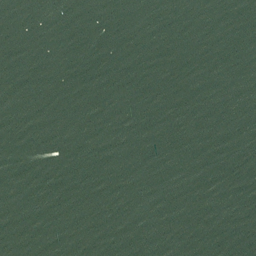
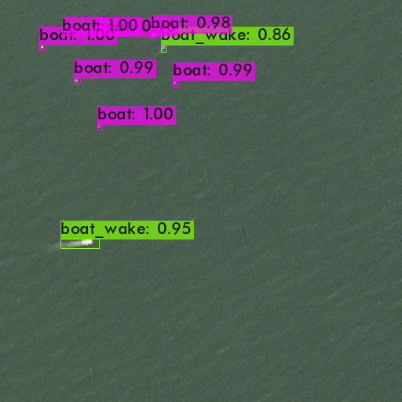

# small-boat-detector
This repository contains the trained yolo v3 configuration file to detect small boats in satellite imagery, used in the paper "Monitoring visitation at North Carolina artificial reefs using high-resolution satellite imagery" submitted for review in Ocean and Coastal Management. **Please contact me for trained model weights (file exceeds size limits)**.

- [Requirements](#Requirements)
- [Test on an image](#Test-on-an-image)
- [Tips for project set-up](#Project-Tips)

## Requirements
This project used the darknet neural networks for object detection from the [AlexeyAB/darknet](https://github.com/AlexeyAB/darknet) repository. To use the trained model weights and the configuration file that was used in this study to detect boats in Planet satellite imagery, you would need to install darknet according to the directions in that repository.

Once successfully installed, run the test code provided in the darknet README file:

  `./darknet.exe detect cfg/yolov3.cfg yolov3.weights data/dog.jpg`

## Test on an image
Also included is an image from the study. 

To use our trained weights to detect the boats in this image, run the following code:

`./darknet.exe detector test data/obj.data cfg/yolov3_boatv3.cfg backup/yolov3_boatv3_final.weights data/testImage_20180805_151747_104a_3B_Visual.png`

Detection Results:

## Project Tips
Darknet will be installed on your computer. We found that it was easiest to have all files and data associated with detection to be located within the darknet directory. Within the directory, you should have the following folders (these should already exist from downloading darknet):
- data
  - obj
  - test.txt
  - train.txt
  - valid.txt
  - obj.data
  - obj.names
- cfg
  - yolov3_boat.cfg

Replace any images and text files within data/obj with your images and txt files. The txt files should include the class and the yolo coordinates. The test, train, and valid txt files should include the path (i.e., data/obj/imageName.png) for the set of images selected for testing, training, and validation.

### To train the model:

To train the model FROM SCRATCH that also outputs a log of model training and calculates mean average precision (map), first change directory (cd) to darknet. Then run:

`./darknet.exe detector train data/obj.data cfg/yolov3_boat.cfg darknet53.conv.74 -map | tee ./log.txt`

The obj.data file has the path to the training and validation txt files (data/train.txt, data/valid.txt).

### To evaluate model performance on test set:

This code gets the images and saves the resulting detections in a .json file.

`Get-Content data/test.txt | ./darknet.exe detector test data/obj.data cfg/yolov3_boat.cfg backup/yolov3_boat_final.weights -ext_output -dont_show -out result.json`

### To run on your dataset:

dataset.txt should include the paths of all of your images you want to detect boats in.

`Get-Content data/dataset.txt | ./darknet.exe detector test data/obj.data cfg/yolov3_boat.cfg backup/yolov3_boat_final.weights -ext_output -dont_show -out dataset_result.json`

